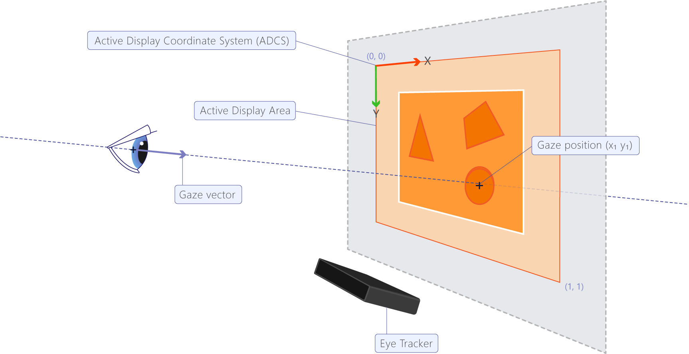

.. _eyeTracker:

Eye Tracker
***********

We used an Eye Tracker 5 and Eye tracker EyeX for the gaming range and a Eye Tracker Pro nano for the research range.

For more information about how working an Eye tracker and about Eye, see `Eye tracking essentials in Tobii Documentation <https://www.tobiipro.com/learn-and-support/learn/eye-tracking-essentials/>`__ .

.. _eyeTrackerTerminology:

Terminology
===========

-   gaze : it represent the spot of the screen you’re looking at.

-   fixation : it is a cluster of gazes close to each other, the size of the circle represent the duration of the fixation and its centre is located at the centroid of all the gazes in it.

.. _eyeTrackerLibrary:

Eye tracker Library
===================

.. _eyeTrackerInteractionLibrary:

Interaction Library
-------------------

To get the eyeTracker Data (eyes and head position), we use the
Interaction Library. See `offline Documenation <./documentations/InteractionLibrary/interaction_lib_sdk_doc.zip>`__ or `online Documentation <https://developer.tobii.com/product-integration/interaction-library/getting-started/>`__ .

Please see the :ref:`requirementInteractionLibrary` in :ref:`requirementEyeTracker` section.

Data Acquisition
^^^^^^^^^^^^^^^^

Eye Tracker Code
^^^^^^^^^^^^^^^^

.. dropdown:: Click to view the Interaction Library Code

    .. dropdown:: Click to view the C++ main code

        .. literalinclude:: /files/eyeTracker.cpp
            :language: c++
            :linenos:
            :name: eyeTrackerCode
            :caption: C++ main file 

    .. dropdown:: Click to view C++ header code

        .. literalinclude:: /files/eyeTracker.h
            :language: c++
            :linenos:
            :name: eyeTrackerCodeHeader
            :caption: C++ header file 

.. _eyeTrackerSDKPRO:

SDK Pro
-------

`SDK Pro Documentation <http://developer.tobiipro.com/>`__

**Important** : SDK Pro only work with python 3.6.

Data Acquisition
^^^^^^^^^^^^^^^^

We acquire some data with the SDK Pro :

Gaze
""""

With acquire the Gaze in 2D and 3D.

For the 2D Gazes (Gazes Points), we used the Active Display Coordinate System (See :numref:`ADCS`).

For the 3D Gazes (Gazes Origin), we used the User Coordinate System System (See :numref:`UCS`).

We also saving the Track Box Coordinate System (See :numref:`TBCS` but not used it).

The gaze is provided for the left and right eye individually and we create one gaze position (the mean of left and rigth eyes coordinates).

For more information, see `Gazes in SDP Pro Documentation <http://developer.tobiipro.com/commonconcepts/gaze.html>`__ and 
`Coordinate systems in SDP Pro Documentation <http://developer.tobiipro.com/commonconcepts/coordinatesystems.html>`__ .

   Active Display Coordinate System

   User Coordinate System

   Track Box Coordinate System

Pupil diameter 
""""""""""""""

The pupil diameter data is provided for the left and the right eye individually and is an estimate of the pupil size in millimeters. 

For more information, see `Pupil diameter in SDP Pro Documentation <http://developer.tobiipro.com/commonconcepts/pupildiameter.html>`__ .

SDK Pro Python Code
^^^^^^^^^^^^^^^^^^^

If you want to create an exe file, please see :ref:`compilationEXE` in :ref:`compilation` section.

**Important** : SDK Pro only work with python 3.6.

.. dropdown:: Click to view the SDK PRO code in python

    .. literalinclude:: /files/eyeTrackerPro.py
        :language: python
        :linenos:
        :name: eyeTrackerPro
        :caption: EyeTracker SDK Pro

.. _eyeTrackerOutputFiles:

Output Files
============

Interaction Library
-------------------

Example of eyeTracker.csv file :

.. container:: center

   .. table:: eyeTracker.csv Example
      :name: eyeTrackerCSVExample

      +---------+---------+---------------+-------------------+-------------------+
      | x_gaze  | y_gaze  | validity_gaze | timestamp_us_gaze | unix_time_ms_gaze |
      +---------+---------+---------------+-------------------+-------------------+
      | 393.616 | 248.489 | valid         | 731431715         | 1619162351442     |
      +---------+---------+---------------+-------------------+-------------------+
      | 393.948 | 249.866 | valid         | 731462309         | 1619162351473     |
      +---------+---------+---------------+-------------------+-------------------+
      | 405.775 | 250.615 | valid         | 731492116         | 1619162351506     |
      +---------+---------+---------------+-------------------+-------------------+
      | 510.267 | 238.748 | valid         | 731522366         | 1619162351541     |
      +---------+---------+---------------+-------------------+-------------------+
      | 655.38  | 219.609 | valid         | 731552436         | 1619162351566     |
      +---------+---------+---------------+-------------------+-------------------+

 
In the :numref:`eyeTrackerCSVExample` , we can see the ouptup of the eyetracker data recorded during
the simulation.

"x" and "y" are the gazes position on the screen.

If the eyetracker doesn’t detect the eyes during the simulation, the
parameter "validity_gaze" is set to "invalid" and for the report all
invalid data are ignored.

Timestamp is merely a number for an instant in time. It’s based from the
processor clock and is counted in micro-seconds. We use it to calculate
the fixation time and the velocity.

The Unix Time ("unix_time_ms_gaze" parameter) has been used to
synchronize the start and the end of the recordings. For the report, all
data before and after the simulation are ignored.

Example of eyeTrackerHead.csv file :

.. container:: center

   .. table:: eyeTrackerHead.csv Example
      :name: eyeTrackerHeadCSVExample  

      +------------+------------+------------+-------------------+--------------+-------------------+------------+------------+------------+----------------+----------------+----------------+
      | head_pos_x | head_pos_y | head_pos_z | timestamp_us_head | validity_pos | unix_time_ms_head | head_rot_x | head_rot_y | head_rot_z | validity_rot_x | validity_rot_y | validity_rot_z |
      +------------+------------+------------+-------------------+--------------+-------------------+------------+------------+------------+----------------+----------------+----------------+
      | -30.9736   | 89.602     | 580.359    | 731425089         | valid        | 1619162351443     | 0.223097   | 0.0263196  | 0.0778362  | valid          | valid          | valid          |
      +------------+------------+------------+-------------------+--------------+-------------------+------------+------------+------------+----------------+----------------+----------------+
      | -30.9749   | 89.5561    | 580.256    | 731455296         | valid        | 1619162351460     | 0.232375   | 0.017596   | 0.0731111  | valid          | valid          | valid          |
      +------------+------------+------------+-------------------+--------------+-------------------+------------+------------+------------+----------------+----------------+----------------+
      | -30.9786   | 89.5267    | 580.186    | 731485503         | valid        | 1619162351486     | 0.24615    | 0.0135308  | 0.0736123  | valid          | valid          | valid          |
      +------------+------------+------------+-------------------+--------------+-------------------+------------+------------+------------+----------------+----------------+----------------+
      | -30.9207   | 89.4498    | 579.941    | 731515712         | valid        | 1619162351521     | 0.253819   | 0.00824669 | 0.0734395  | valid          | valid          | valid          |
      +------------+------------+------------+-------------------+--------------+-------------------+------------+------------+------------+----------------+----------------+----------------+
      | -30.7682   | 89.259     | 579.301    | 731545921         | valid        | 1619162351551     | 0.264841   | 0.00560519 | 0.0704814  | valid          | valid          | valid          |
      +------------+------------+------------+-------------------+--------------+-------------------+------------+------------+------------+----------------+----------------+----------------+      
  
  
We can capture some head position data like the head position in front of the eyetracker and the head rotation (:numref:`eyeTrackerHeadCSVExample`).

The "timestamp_us_head", "unix_time_ms_head", "validity_pos", "validity_rot_*" are the same parameters as the eyes Data.

*Important :* The record of the position of the head works only for the
tobii eye Tracker 5. Otherwise, the eyeTrackerHead.csv will be empty (it
will only contain the header).

SDK Pro
-------

Example eyeTracker.csv file :

.. container:: center

   .. table:: eyeTracker.csv Example
      :name: eyeTrackerCSVProExample 

      +--------------------+--------------------+---------------+-------------------+-------------------+---------------------------------+---------------------+----------------------------------+----------------------+--------------------+--------------------+------------------------+--------------------+--------------------+-------------------------+
      | x_gaze             | y_gaze             | validity_gaze | timestamp_us_gaze | unix_time_ms_gaze | left_pupil_diameter_millimeters | left_pupil_validity | right_pupil_diameter_millimeters | right_pupil_validity | left_eye_x_gaze    | left_eye_y_gaze    | left_eye_validity_gaze | right_eye_x_gaze   | right_eye_y_gaze   | right_eye_validity_gaze |
      +--------------------+--------------------+---------------+-------------------+-------------------+---------------------------------+---------------------+----------------------------------+----------------------+--------------------+--------------------+------------------------+--------------------+--------------------+-------------------------+
      | 234.51786518096924 | 359.00160133838654 | valid         | 1010711977        | 1624622093795     | 3.8783721923828125              | 1                   | 4.2047271728515625               | 1                    | 228.95484924316406 | 428.24059009552    | 1                      | 240.0808811187744  | 289.76261258125305 | 1                       |
      +--------------------+--------------------+---------------+-------------------+-------------------+---------------------------------+---------------------+----------------------------------+----------------------+--------------------+--------------------+------------------------+--------------------+--------------------+-------------------------+
      | 255.6152057647705  | 350.63529789447784 | valid         | 1010728632        | 1624622093811     | 3.9310302734375                 | 1                   | 4.2739105224609375               | 1                    | 260.50360679626465 | 432.6551306247711  | 1                      | 250.72680473327637 | 268.61546516418457 | 1                       |
      +--------------------+--------------------+---------------+-------------------+-------------------+---------------------------------+---------------------+----------------------------------+----------------------+--------------------+--------------------+------------------------+--------------------+--------------------+-------------------------+
      | 261.92142963409424 | 359.91851449012756 | valid         | 1010745287        | 1624622093828     | 3.9920806884765625              | 1                   | 4.2491912841796875               | 1                    | 265.1943111419678  | 419.43352460861206 | 1                      | 258.6485481262207  | 300.40350437164307 | 1                       |
      +--------------------+--------------------+---------------+-------------------+-------------------+---------------------------------+---------------------+----------------------------------+----------------------+--------------------+--------------------+------------------------+--------------------+--------------------+-------------------------+
      | 258.82033824920654 | 318.9457333087921  | valid         | 1010761941        | 1624622093845     | 4.1212005615234375              | 1                   | 4.25335693359375                 | 1                    | 261.5834140777588  | 353.34168434143066 | 1                      | 256.0572624206543  | 284.54978227615356 | 1                       |
      +--------------------+--------------------+---------------+-------------------+-------------------+---------------------------------+---------------------+----------------------------------+----------------------+--------------------+--------------------+------------------------+--------------------+--------------------+-------------------------+
      | 256.9408178329468  | 300.7209116220474  | valid         | 1010778596        | 1624622093862     | 4.1796112060546875              | 1                   | 4.255126953125                   | 1                    | 262.7739429473877  | 322.12003111839294 | 1                      | 251.10769271850586 | 279.3217921257019  | 1                       |
      +--------------------+--------------------+---------------+-------------------+-------------------+---------------------------------+---------------------+----------------------------------+----------------------+--------------------+--------------------+------------------------+--------------------+--------------------+-------------------------+

In the :numref:`eyeTrackerCSVProExample` , we can see the ouptup of the eyetracker data recorded during
the simulation.

"x" and "y" are the mean gazes position on the screen of the left and right eyes.

If the eyetracker doesn’t detect the both eyes during the simulation, the
parameter "validity_gaze" is set to "invalid" and for the report all
invalid data are ignored. If only one eye is detected, the "x" and the "y" are the gaze position for this eye.

Timestamp is merely a number for an instant in time. It’s based from the
processor clock and is counted in micro-seconds. We use it to calculate
the fixation time and the velocity.

The Unix Time ("unix_time_ms_gaze" parameter) has been used to
synchronize the start and the end of the recordings. For the report, all
data before and after the simulation are ignored.

For left and right eyes, we saving the pupil diameter in millimeters and "pupil_validity", to ensure the validyty of the pupil diameter.

For both eyes, we saving the gazes "x", "y" and the validity.

Example of eyeTrackerHead.csv file :

.. container:: center

   .. table:: eyeTrackerHead.csv Example
      :name: eyeTrackerHeadProCSVExample
         
      +-------------------+--------------------+-------------------+--------------+-------------------+-------------------+---------------------------------------------+---------------------------------------------+---------------------------------------------+---------------------------+----------------------------------------------+----------------------------------------------+----------------------------------------------+----------------------------+--------------------------------------------------+--------------------------------------------------+--------------------------------------------------+---------------------------------------------------+---------------------------------------------------+---------------------------------------------------+
      | head_pos_x        | head_pos_y         | head_pos_z        | validity_pos | timestamp_us_head | unix_time_ms_head | left_x_gaze_point_in_user_coordinate_system | left_y_gaze_point_in_user_coordinate_system | left_z_gaze_point_in_user_coordinate_system | left_gaze_origin_validity | right_x_gaze_point_in_user_coordinate_system | right_y_gaze_point_in_user_coordinate_system | right_z_gaze_point_in_user_coordinate_system | right_gaze_origin_validity | left_x_gaze_origin_in_trackbox_coordinate_system | left_gaze_y_origin_in_trackbox_coordinate_system | left_z_gaze_origin_in_trackbox_coordinate_system | right_x_gaze_origin_in_trackbox_coordinate_system | right_y_gaze_origin_in_trackbox_coordinate_system | right_z_gaze_origin_in_trackbox_coordinate_system |
      +-------------------+--------------------+-------------------+--------------+-------------------+-------------------+---------------------------------------------+---------------------------------------------+---------------------------------------------+---------------------------+----------------------------------------------+----------------------------------------------+----------------------------------------------+----------------------------+--------------------------------------------------+--------------------------------------------------+--------------------------------------------------+---------------------------------------------------+---------------------------------------------------+---------------------------------------------------+
      | 8.678815841674805 | 22.54614543914795  | 525.7163391113281 | valid        | 1010695323        | 1624622093777     | -25.46792984008789                          | 20.452484130859375                          | 528.503173828125                            | 1                         | 42.8255615234375                             | 24.639806747436523                           | 522.9295043945312                            | 1                          | 0.581534206867218                                | 0.42874208092689514                              | 0.25902318954467773                              | 0.39626166224479675                               | 0.4151560962200165                                | 0.2505168318748474                                |
      +-------------------+--------------------+-------------------+--------------+-------------------+-------------------+---------------------------------------------+---------------------------------------------+---------------------------------------------+---------------------------+----------------------------------------------+----------------------------------------------+----------------------------------------------+----------------------------+--------------------------------------------------+--------------------------------------------------+--------------------------------------------------+---------------------------------------------------+---------------------------------------------------+---------------------------------------------------+
      | 9.445442199707031 | 22.261903762817383 | 525.9622192382812 | valid        | 1010711977        | 1624622093795     | -24.515167236328125                         | 19.98628807067871                           | 528.7755737304688                           | 1                         | 43.40605163574219                            | 24.537519454956055                           | 523.1488647460938                            | 1                          | 0.5789461731910706                               | 0.430486798286438                                | 0.25944140553474426                              | 0.39473435282707214                               | 0.41558438539505005                               | 0.2510392963886261                                |
      +-------------------+--------------------+-------------------+--------------+-------------------+-------------------+---------------------------------------------+---------------------------------------------+---------------------------------------------+---------------------------+----------------------------------------------+----------------------------------------------+----------------------------------------------+----------------------------+--------------------------------------------------+--------------------------------------------------+--------------------------------------------------+---------------------------------------------------+---------------------------------------------------+---------------------------------------------------+
      | 9.114437103271484 | 23.052979469299316 | 526.6603698730469 | valid        | 1010728632        | 1624622093811     | -24.882705688476562                         | 20.925498962402344                          | 529.4545288085938                           | 1                         | 43.11157989501953                            | 25.18045997619629                            | 523.8662109375                               | 1                          | 0.5798258781433105                               | 0.4272003769874573                               | 0.26090356707572937                              | 0.39568036794662476                               | 0.41336506605148315                               | 0.2524798512458801                                |
      +-------------------+--------------------+-------------------+--------------+-------------------+-------------------+---------------------------------------------+---------------------------------------------+---------------------------------------------+---------------------------+----------------------------------------------+----------------------------------------------+----------------------------------------------+----------------------------+--------------------------------------------------+--------------------------------------------------+--------------------------------------------------+---------------------------------------------------+---------------------------------------------------+---------------------------------------------------+
      | 9.147893905639648 | 23.146384239196777 | 527.04638671875   | valid        | 1010745287        | 1624622093828     | -24.86520004272461                          | 21.102148056030273                          | 529.8452758789062                           | 1                         | 43.160987854003906                           | 25.19062042236328                            | 524.2474975585938                            | 1                          | 0.5797252655029297                               | 0.4266241788864136                               | 0.2616960406303406                               | 0.3956315815448761                                | 0.4133952558040619                                | 0.25324803590774536                               |
      +-------------------+--------------------+-------------------+--------------+-------------------+-------------------+---------------------------------------------+---------------------------------------------+---------------------------------------------+---------------------------+----------------------------------------------+----------------------------------------------+----------------------------------------------+----------------------------+--------------------------------------------------+--------------------------------------------------+--------------------------------------------------+---------------------------------------------------+---------------------------------------------------+---------------------------------------------------+
      | 9.239023208618164 | 23.138446807861328 | 527.7142333984375 | valid        | 1010761941        | 1624622093845     | -24.816959381103516                         | 21.14855194091797                           | 530.5216064453125                           | 1                         | 43.295005798339844                           | 25.128341674804688                           | 524.9068603515625                            | 1                          | 0.5795101523399353                               | 0.4265573024749756                               | 0.2630452811717987                               | 0.39541786909103394                               | 0.4137377142906189                                | 0.2545768916606903                                |
      +-------------------+--------------------+-------------------+--------------+-------------------+-------------------+---------------------------------------------+---------------------------------------------+---------------------------------------------+---------------------------+----------------------------------------------+----------------------------------------------+----------------------------------------------+----------------------------+--------------------------------------------------+--------------------------------------------------+--------------------------------------------------+---------------------------------------------------+---------------------------------------------------+---------------------------------------------------+

We can capture some head position data like the head position in front of the eyetracker and the head rotation (:numref:`eyeTrackerHeadProCSVExample`).

The "timestamp_us_head", "unix_time_ms_head", "validity_pos", "validity_rot_*" are the same parameters as the eyes Data.

The "head_pos_*" is the gaze origin (User Coordinates Systems). It's the means of the both eyes coordinates.

We also saving for both eyes the the gaze origin and the Track Box Coordinate System.

.. _eyeTrackerAlgo:

Eye Tracker Algorithm
=====================

.. _eyeTrackerBuscherAlgo:

Buscher Algorithm
-----------------

To process the eyeTracker Data, we use the Buscher Algorithm (See `Buscher Algorithm Documentation <./documentations/Eye-movements-as-implicit-relevance-feedback.pdf>`__ .)  
This algorithm take all the gazes and create fixations with gazes close
to each others. It will first take 4 gazes and check if they all fit in
the same square (30*30 pixel square in our case, see :numref:`Buscher`), if they all fit in the
square these gazes become the start of a fixation.

We then take the next gaze and check if it fit in a bigger square with
the first ones (50*50 pixel), if it fit we add it to the fixation and go
to the next gaze.

If a gaze doesn’t fit in the bigger square it is labelled as a fail (gaze p5 in :numref:`Buscher`) and
we take the next gaze, if 4 consecutive gazes are labelled as fails the
fixation end at the last gaze that fit in the bigger square. This
algorithm allow to ignore the errors during the recording that may
generate gazes that are separated from the others.

To start the next fixation we take the first of the 4 gazes that were
labelled as fails and repeat the steps above.

   Buscher algorithm principle

To determine the duration of the fixation we subtract the timestamp of
the first gaze to the one of the last gaze in the fixation. The centre
of the fixation is defined as the centroid of all the gazes.

See :ref:`reportEyeTracker` in :ref:`report` section to view
an example.

.. dropdown:: Click to view the Buscher Algorithm in python

    .. literalinclude:: /files/Buscher.py
        :language: python
        :linenos:
        :name: buscherCode
        :caption: Buscher Algorithm

.. _eyeTrackerNystromAlgo:

Nystrom Algorithm
-----------------

Other algorithm exist to process the eye tracker data like the Nystrom algorithm (See `Nystrom Algorithm Documentation <./documentations/Nyström-Holmqvist2010_Article_AnAdaptiveAlgorithmForFixation.pdf>`__).
It is implemented in Eye Got It and can be used but Buscher is used by default.
The main difference with Buscher is that Nystrom uses the velocity of the gazes to determine the position of the fixations and saccades.

The first step is to calculate a main velocity threshold (See :numref:`Nystrom_threshold`).
It is an iterative process and thus different for each set of data, once we have the main velocity threshold we can detect potential saccades.

.. figure:: images/threshold.png
   :alt: threshold calculation method
   :name: Nystrom_threshold
   :width: 100.0%

   threshold calculation method

For each potential saccades we have to find the onset and the offset, the onset threshold is the same for each saccade but the offset threshold is calculated each time there is a new potential saccade (See :numref:`Nystrom_onset_offset`).

.. figure:: images/onset_offset.jpg
   :alt: finding the onset and offset of the saccade
   :name: Nystrom_onset_offset
   :width: 100.0%

   finding the onset and offset of the saccade

Once we have determine the position of the saccades we just have to take the remaining gazes between the saccades and form fixations.

See :ref:`reportEyeTracker` in :ref:`report` section to view
an example.

.. dropdown:: Click to view the Nystrom Algorithm in python

    .. literalinclude:: /files/Nystrom.py
        :language: python
        :linenos:
        :name: nystromrCode
        :caption: Nystrom Algorithm

.. _eyeTrackerGazeVelocityAcceleration:

Gaze Velocity and Acceleration
------------------------------

    Gaze Velocity and Acceleration

The unit we use for the reading speed is the degree of visual angle per
second. It is the angle the eye make in a second so to calculate it we
need the distance of the user from the screen. The sizeInDeg
function convert the distance in pixel we give to it to degrees of
visual angle then velocityInDeg calculate the velocity and
acceleration for each gaze. 

.. dropdown:: Click to view the VelocityInDeg and sizeInDeg function

    .. literalinclude:: /files/VelocityInDeg.py
        :language: python
        :linenos:
        :name: velocityInDeg
        :caption: VelocityInDeg function

