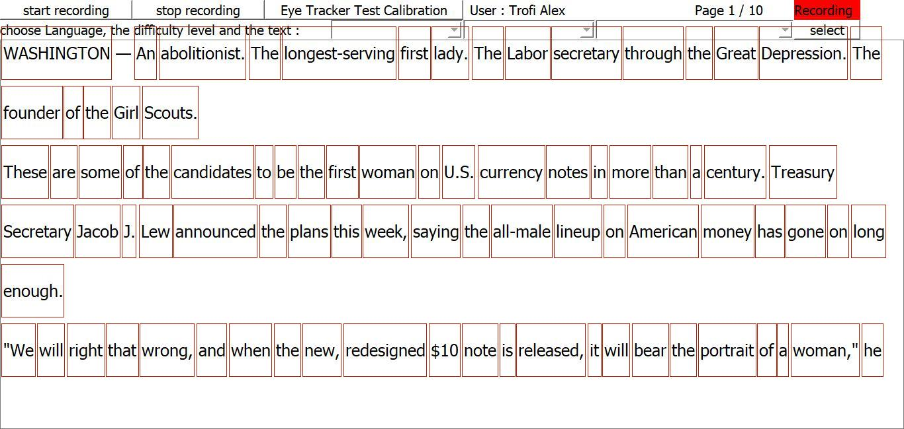
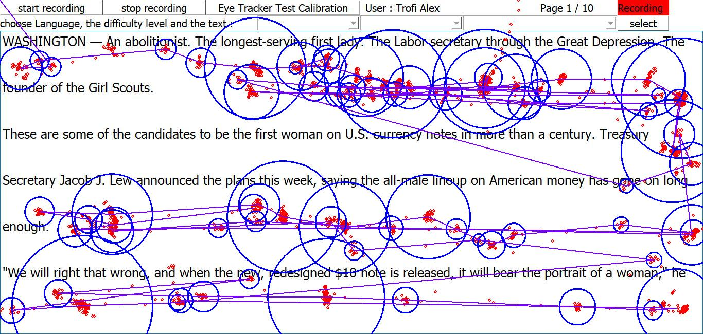
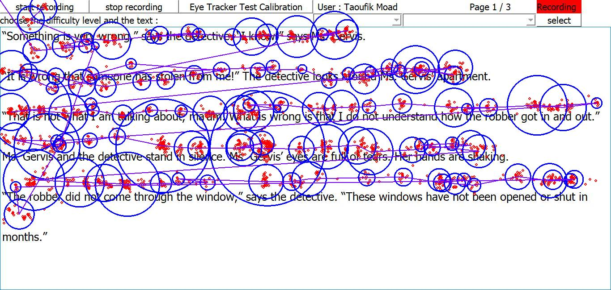

.. _reportValidation:

Report Validation
*****************

Parameters
==========

Report validation is based on three parameters :

- Percentage of fixations whose centre is in a word : "Fixations in words" (Threshold 80%)

- Percentage of words with at least one fixation : "Words with at least a fixation" (Threshold 60%)

- Percentage of eyegaze in fixation's circles : "Eyegazes in fixation" (Threshold 70%)

Those three parameters are displayed at the end of report generation in a result window. Thresholds are defined to determine whether the data is finally valid or not. If a paramater value is under his threshold, data is considered not valid.

.. figure:: images/fonctionnementTraitement.png
   :alt: Traitement
   :name: Traitement Validation
   :width: 100.0%

   Traitement des données

Principe de fonctionnement 
==========

Chaque mot d'un texte dispose d'un rectangle d'une certaine taille autour de lui, il nous est utile dans l'analyse de la 1ère donnée. On va venir matcher les centres des fixations avec l'emplacement des rectangles et ainsi voir combien de fixations sont associées à un mot.

   Position des mots

Afin de compléter cette 1ère donnée, nous analysons de la même manière le nombre de mots qui dispose d'au moins une fixation.

Finalement, on ajoute à tout ceci l'analyse des regards. On veut ici voir si les regards ne sont pas éparpillés un peu partout sur l'écran et si la plupart appartiennent à une fixation.

Examples
========

.. figure:: images/BadData.png
   :alt: Bad Data
   :name: BadData
   :width: 100.0%

   Bad data visualization

.. figure:: images/reportBadRecord.png
   :alt: Report Mauvais Record
   :name: Report Mauvais Record
   :width: 50.0%

   Report Mauvais Record

   En regardant les résultats de cet exemple, on comprend qu’il est potentiellement mauvais, ici nous avons moins de 60% de réussite sur les deux dernières données. Mais si on se basait sur la première donnée on pourrait se dire que finalement celui-ci n’est pas trop mauvais, en effet en regardant l’image des fixations on voit que la plupart sont associés à un mot, d’où l’utilité de venir compléter cette information.

Le second pourcentage nous apporte des informations sur le nombre de mots disposant d’au moins une fixation, mais finalement celui-ci pourrait être faussé car lors de notre lecture nous pouvons nous omettre de lire certains mots, ce seront les mots simple tel que “The”, “It”, “is” etc.

En additionnant le nombre de mots “simple” au nombre de mots qu’on a pas forcément lu, ce pourcentage peut vite diminuer sans forcément indiquer une réelle erreur.

   Gazes limit fixations

.. figure:: images/reportLimitGazes.png
   :alt: Gazes limit
   :name: Gazes limit
   :width: 50.0%

   Report gazes limit

   Cet enregistrement nous montre la limite de la 3ème mesure, qui détecte la quantité de regards en dehors des fixations. Cette donnée nous invite à nous demander quant à la validité des fixations.
Mais il faut faire attention, elle nous indique seulement si les regards sont bien dans une fixation. Car comme ici, nous avons un bon taux de regards appartenant à une fixation mais les fixations ne sont pas bonnes.

   Good data visualization

.. figure:: images/reportGoodRecord.png
   :alt: Report Good Record 1
   :name: Report Good Record 1
   :width: 50.0%

   Report Good Record

   Malgré le peu de visibilité de certains enregistrements, certains sont plutôt bon. Les rectangles autour des mots sont assez étirés, c'est pour cela que certaines fixations qui ont l'air d'être au dessus des mots, sont en fait associées à celui-ci.

   Il faut aussi faire attention à la 2ème donnée qui est souvent la moins basse des 3 sur les bons enregistrements. Le centre des fixations est parfois difficilement repérable et il se peut que celui-ci soit exactement dans le petit espace entre 2 mots. Donc les fixations quelques fixations auront l'air d'être dans un mot, mais n'appartiennent à personnes en réalité.

.. figure:: images/fixationsPerfectRecord.png
   :alt: Good Record
   :name: Good Record
   :width: 100.0%

   Good Record

.. figure:: images/reportPerfectRecord.png
   :alt: Report Good Record
   :name: Report Good Record
   :width: 50.0%

   Report Good Record

Nous avons ici un bon enregistrement, la plupart des mots ont leur fixations, les regards sont beaucoup à appartenir à une fixation et chaque mots n'a pas plus d'une seule fixation à son compteur.

A la suite de cette analyse, la validité des enregistrements est inscrit dans le fichier texte du rapport de chaque dossier d'enregistrement.